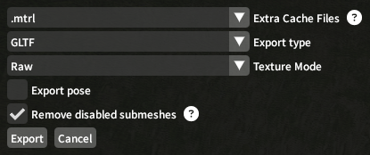

 

FFGear is a Blender addon for handling FFXIV gear shading and applying dyes to them directly in Blender.
It allows for easily setting up shaders for [Meddle](https://github.com/PassiveModding/Meddle) exports (but will also work with other methods).
It's meant to allow for more customizability after you've already exported a character.
&nbsp;

&nbsp;

## Notable Features
- Dye your gear directly in Blender!
- Automatic setup for Meddle exports!
- Submaterial Textures (the fabric details and stuff)!
- A lot of artistic control!
&nbsp;

&nbsp;

## Installation
- Download the latest ZIP from [Releases](https://github.com/kajupe/FFGear/releases)
- In Blender, go to `Edit > Preferences > Add-ons > Dropdown in the top-right > Install from Disk...` and Select the ZIP
&nbsp;

&nbsp;

## Usage
Each material now has an "FFGear" tab, in which you'll see a "Setup" area and a "Dye Colors" area.
&nbsp;  
&nbsp; 

**If your character has been exported with Meddle:**\
Import it and select all the relevant objects, then press the "Automatic Meddle Setup" button, then select the cache folder in your meddle export.\
This should automatically set up shaders for all selected gear.

**If you want to do it the more manual way:**\
Start by selecting each required file (mtrl and textures) in the Setup area. Then create a material with the button labeled "Create This Material". Shift-clicking will do this across multiple selected objects.
&nbsp;  
&nbsp; 

To dye the item, use the Dye Colors area, select your dye(s) and click "Update Color Ramps". By default though, "Auto Update Dyes" is enabled for new materials which will automatically update your material when a dye is changed, so you don't have to press the button every time.

For more information please check out the [Wiki](https://github.com/kajupe/FFGear/wiki) page!
&nbsp;

&nbsp;

## ⚠ Important Meddle Info
With characters exported using version 0.1.29 or later of Meddle, you need to make sure .mtrl files are cached

&nbsp;

&nbsp;

## Limitations, Disclaimers & Good-to-know Info
- It is important to note that these materials are an approximation to how they look in-game, so although it looks very similar it is not a 1:1 recreation. The goal of this project is, primarily, making it look good in Blender. To allow for extra artistic control, the FFGear Shader node group has plenty of user-accesible controls for simple tweaks, and all of the values the addon calculates are readily available in the shader graph for you to create your own shaders with if need be. If you want to change how this shader behaves by default you can edit it in the blend-file in the plugins "assets" folder.

- The shaders will look best using Eevee. Blender does a good job at bridging the gap between its renderers, however Cycles lacks "proper" backface culling which results in many visual glitches on FFXIV models. A "Backface Culling" node is provided in the shader editor but it will likely not make a big difference. I recommend removing duplicate faces from your mesh manually if you plan on using Cycles. It's annoying, I know.

- FFGear is not meant to work on anything other than gear shaders, such as skin or hair. It's meant to cover "character.shpk" and "characterlegacy.shpk" only. I recommend using [Meddle Tools](https://github.com/PassiveModding/MeddleTools) shaders for everything else, or making your own.

- Data from the mtrl file is not always placed into blender 1:1, meaning the code sometimes changes the values beforehand. One such case is Gloss values from the legacy shader being converted into Roughness values with this formula: 0.9 * (1 - (x - 5) / 20) (Linear mapping so 25 becomes 0 and 5 becomes 0.9). The tile texture transformation matrix data is also converted into more user-friendly values: scales, rotation and shear.

- I am by no means an expert programmer, if you find issues with the addon please inform me of them by [filing an issue](https://github.com/kajupe/FFGear/issues) here on github. I also made this over like six months on and off, and I was kind of shit at the start, my programming style changed a lot, and while I have refactored a lot of it a more experienced programmer will likely think this is a fucking mess. I agree with you, sorry :)

- I have no idea if this works on Mac or Linux, I have only tested it on Windows 10. If you run into issues using Mac or Linux, [file an issue](https://github.com/kajupe/FFGear/issues) and make sure to include any errors the console spits out at you. Make sure to describe what you were doing to cause the issue, too.
&nbsp;

&nbsp;

## Acknowledgements

💖 The [xivModdingFramework](https://github.com/TexTools/xivModdingFramework) and [Penumbra](https://github.com/xivdev/Penumbra) - Thanks for having all that code public so I could figure out how to read the silly FF files!

💖 [PassiveModding](https://github.com/PassiveModding) - Thanks for inspiring the whole project basically, and the incredible tool [Meddle](https://github.com/PassiveModding/Meddle), and for the code to check for new addon versions from inside Blender which I yoinked from [Meddle Tools](https://github.com/PassiveModding/MeddleTools), and for adding extra Dye ID data to Meddle exports when I asked for it so this project can integrate more seamlessly! 

💖 [NotNite](https://github.com/NotNite/) - Thanks for [Alpha](https://github.com/NotNite/Alpha), making it really easy to find and dig up files I needed!

💖 [ShinoMythmaker](https://github.com/Shinokage107) - Thanks for answering my questions about how you made the [MekTools](https://github.com/MekuMaki/Mektools) auto-update system!

💖 [Chirp](https://github.com/chirpxiv) - Thanks for helping me with another project a while ago and for inspiring be to do cooler coding things! And for being a good friend :)

💖 Everyone who has shown interest - Thank you to everyone who showed interest in the project or encouraged its development when I posted about it. It's been really cool, and warms my heart. Sorry it took so long lmao
